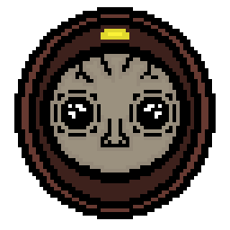

|  | **Throwaways** |
|------------------------------------------------------|--------------------------|

|  | **Throwaways** |
|-----------------------------------------|----------------------------------------------------------|
-------------------------------
## Game Presentation

Throwaways is a 2D roguelike, twin-stick shooter with a top-down view 
where players explore
 procedurally generated dungeons filled with a mix 
 of strange monsters and bosses.
 Throwaways emphasizes randomized loot drops and 
 power-ups that dramatically change gameplay with each run, creating a unique 
 experience every time.
 The game combines fast-paced combat with strategic decision-making, 
 as players choose which items to keep or toss, affecting both combat 
 and character stats.

-------------------------------
## Inputs

### MOVE
- **W** - UP
- **S** - DOWN
- **A** - LEFT
- **D** - RIGHT

### SHOOT
- **↑** - UP
- **↓** - DOWN
- **←** - LEFT
- **→** - RIGHT

-------------------------------

## Observatii:
EDITOR VERSION: 2022.3.40f1 
Trebuie sa selectati Main Menu din Assets>Scenes 
Am atasat si un video demo pentru sprinturi in folderul Rapoarte

-------------------------------
## Trimiteti raportul la adresa: mecca.rares@gmail.com.
