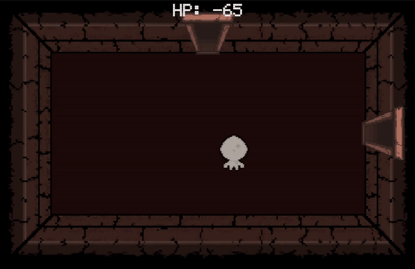

|  | **THROWAWAYS** |
|------------------------------------------------------|--------------------------|

-------------------------------
## Game Presentation

Throwaways is a 2D roguelike, twin-stick shooter with a top-down view 
where players explore
 procedurally generated dungeons filled with a mix 
 of strange monsters and bosses.
 Throwaways emphasizes randomized loot drops and 
 power-ups that dramatically change gameplay with each run, creating a unique 
 experience every time.
 The game combines fast-paced combat with strategic decision-making, 
 as players choose which items to keep or toss, affecting both combat 
 and character stats.

-------------------------------
## Inputs

### MOVE
- **W** - UP
- **S** - DOWN
- **A** - LEFT
- **D** - RIGHT

### SHOOT
- **↑** - UP
- **↓** - DOWN
- **←** - LEFT
- **→** - RIGHT

-------------------------------

## Observatii:
EDITOR VERSION: 2022.3.40f1<br />
Trebuie sa selectati Main Menu din Assets>Scenes<br />
Am atasat si un video demo pentru sprinturi in folderul Rapoarte

-------------------------------
## Trimiteti raportul la adresa: mecca.rares@gmail.com.


## Technical Contents

1. [Player Movement](#plyer-shooting)
2. [Shooting](#shooting)
3. [Map Generation](#map-generation)

-------------------------------

# Player Movement

We first create our input vector:

 ```cs
    float speed = GameManager.currentMS;

    float horizontal = Input.GetAxis("Horizontal");
    float vertical = Input.GetAxis("Vertical");

    Vector2 inputVector 
        = new Vector2(horizontal, vertical).normalized; 
 ```
We normalize the input to ensure consistent speed.

Next, we account for diagonal movement to correctly adjust the speed.
 
```cs
    bool isDiagonal = horizontal != 0 && vertical != 0;

    float adjustedSpeed 
        = isDiagonal ? speed / Mathf.Sqrt(2) : speed;
```

Now, we calculate the desired speed values and interpolate between the current speed and the target values for animation purposes. This allows for a smooth transition from the idle state to a movement state when the speed is not zero.
```cs

    float targetFrontMovement 
        = Mathf.Abs(inputVector.y * adjustedSpeed);
    float targetSideMovement 
        = Mathf.Abs(inputVector.x * adjustedSpeed);

    animator.SetFloat("FrontMovement", 
        Mathf.Lerp(animator.GetFloat("FrontMovement"), 
                   targetFrontMovement, 
                   Time.deltaTime * 10f));
   
    animator.SetFloat("SideMovement", 
        Mathf.Lerp(animator.GetFloat("SideMovement"), 
                   targetSideMovement,
                   Time.deltaTime * 10f));
```
And for animation purposes again we set the movement direction:

```cs
        if (inputVector != Vector2.zero)
        {
            if (Mathf.Abs(inputVector.y) >= Mathf.Abs(inputVector.x))  // Vertical
            {
                animator.SetInteger("Direction", 
                                    inputVector.y < 0 ? 1 : 2); // Down or Up
            }
            else // Horizontal
            {
                animator.SetInteger("Direction", 
                                    inputVector.x < 0 ? 3 : 4); // Left or Right
            }
        }
```
It is important to note that the transitions between directional movement animations are done without transition time or animation blending.

Returning to the actual rigidbody velocity, we interpolate between the current velocity vector and the target velocity vector. This interpolation ensures a smooth transition between stationary and non-stationary states, preventing the character from stopping abruptly.
```cs
    float smoothingFactor = 5f;

    rigidbody.velocity = Vector3.Lerp(rigidbody.velocity, 
                                    new Vector3(inputVector.x * adjustedSpeed, 
                                                inputVector.y * adjustedSpeed, 0.0f),
                                                Time.deltaTime * smoothingFactor);
```

|The result: |
|---|
|   | 

# Shooting


# Map Generation